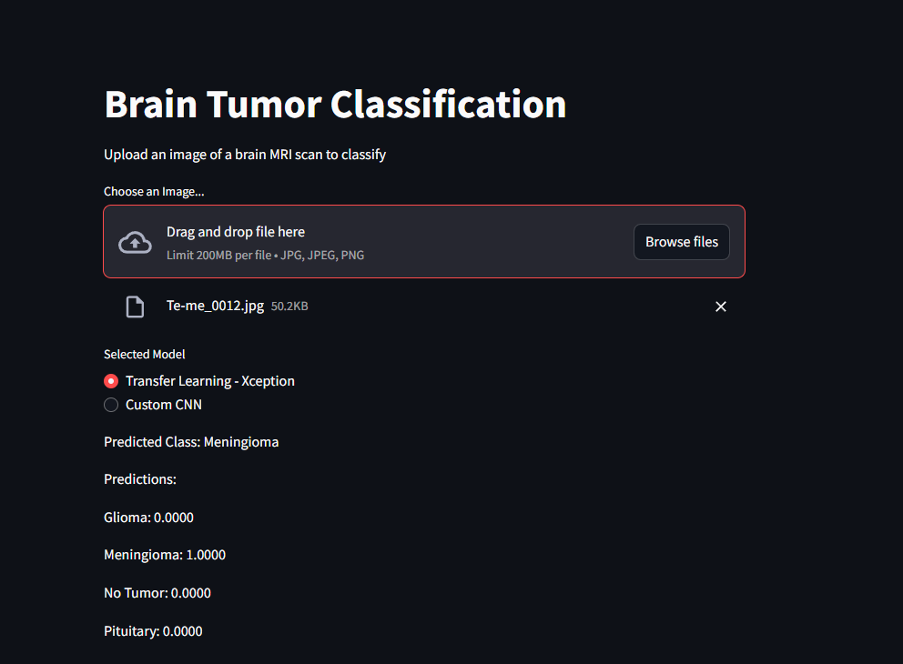
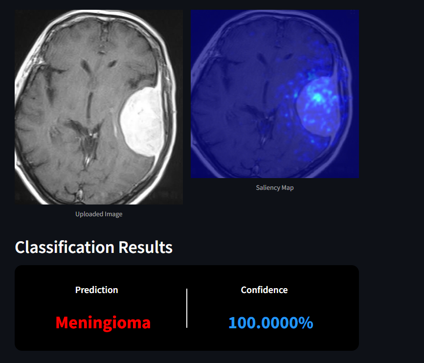
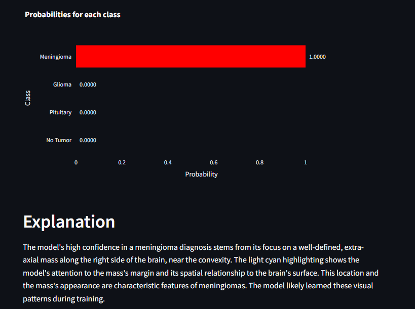

#  Brain Tumor Classification Using Deep Learning

##  Overview
This project focuses on the classification of brain tumors from MRI scans using advanced deep learning techniques. The goal is to assist healthcare professionals in the early detection and diagnosis of brain tumors. The project uses transfer learning with the pre-trained **Xception model** and a custom-built **Convolutional Neural Network (CNN)** to classify MRI images into four categories:

- Glioma
- Meningioma
- Pituitary
- No Tumor

An interactive **Streamlit** web app has been developed to allow users to upload MRI scans and receive predictions along with visual explanations.

##  Screenshots
1. **Streamlit Web App**: 
 
 ---
 
 ---
 
 ---

##  Features

###  Deep Learning Models
- **Xception Model**: 
  - Pre-trained on the ImageNet dataset and fine-tuned for brain tumor classification.
  - Uses deep convolutional layers for feature extraction and classification.
  - Achieves high generalization and accuracy.

- **Custom CNN Model**:
  - Built from scratch using **Keras**.
  - Includes convolutional layers, max pooling, and dense layers.
  - Optimized for MRI image classification, providing robust performance on unseen data.
  - Achieved **98% accuracy** on test data.

###  Interactive Web App
- Developed using **Streamlit** to enable real-time MRI scan analysis.
- Users can upload MRI images and get predictions from both models.
- Provides detailed insights and saliency map visualizations for predictions.

###  Saliency Map Generation
- Integrated **Gemini 1.5 Flash** for generating visual explanations of predictions.
- Highlights key regions of MRI scans that influenced the model’s decision.

###  Challenges Solved:
- Achieved **99% accuracy** using Xception transfer learning and **98% accuracy** with the custom CNN model.
- Added multimodal interaction capabilities for deeper insights into the models' decisions.
- Interactive web app allows real-time predictions and visual explanations of the results.

## 📂 Directory Structure

```plaintext
├── Testing/                # Testing MRI images dataset  
│   ├── glioma/
│   ├── meningioma/
│   ├── notumor/
│   └── pituitary/
├── images/                 # Images for README and documentation
├── drive/                  # Contains pre-trained weights and related assets  
├── saliency_maps/          # Generated visual explanations for MRI scans  
├── sample_data/            # Sample input data for testing the app  
├── app.py                  # Streamlit web app script  
├── cnn_model.h5            # Saved weights for the custom CNN model  
├── xception_model.weights.h5  # Saved weights for the fine-tuned Xception model  
├── [`braintumorclassification.py`](braintumorclassification.py ) # Main script for training and prediction
└── [`README.md`](README.md )               # Project documentation
```

##  Models

### 1. Xception Model
- Pre-trained on the ImageNet dataset and fine-tuned for brain tumor classification.
- Utilizes deep convolutional layers to handle feature extraction.
- Provides excellent generalization and achieves high accuracy.

### 2. Custom CNN Model
- Built from scratch using **Keras**.
- Includes multiple convolutional layers, max pooling, and dense layers.
- Optimized for MRI image classification, achieving robust performance on unseen data.

##  How to Run the Project

### 1. Install Dependencies
Ensure you have **Python 3.9+** installed. Then, install the required packages:

```bash
pip install -r requirements.txt
```

### 2. Run the Streamlit Web App
Launch the app using the following command:

```bash
streamlit run app.py
```

- Upload an MRI image to get predictions from both the Xception and CNN models.

### 3. Train Models (Optional)
If you'd like to train the models from scratch:
1. Modify the training scripts in the **app.py** file.
2. Ensure that the **Training/** and **Testing/** datasets are available.
3. Use **TensorFlow/Keras** to fine-tune or build the models.

##  Challenges Implemented
- **High Accuracy**: Achieved **98%** accuracy with the custom CNN and **99%** accuracy with Xception transfer learning.
- **Interactive Web App**: Enables real-time predictions and saliency map visualizations.
- **Multimodal Explanations**: Integrated **Gemini 1.5 Flash** for advanced visual and textual insights into model decisions.
- **Comparative Analysis**: Dashboard for comparing model predictions.
- **Detailed Reports**: Generates comprehensive prediction reports for doctors and patients.

##  Future Enhancements
- **Multimodal LLM Integration**: Allow interactive chats with MRI scans to explain predictions in more detail.
- **Historical Analysis**: Add a feature to compare predictions with historical MRI data.
- **Mobile Integration**: Create a mobile-friendly app for easier accessibility.

##  Tools & Technologies
- **Programming Language**: Python
- **Deep Learning Framework**: TensorFlow, Keras
- **Web App Framework**: Streamlit
- **Visualization**: Gemini 1.5 Flash for saliency maps
- **Pre-trained Models**: Xception

##  Dataset
The dataset used for this project contains labeled MRI scans categorized into:

- Glioma
- Meningioma
- Pituitary
- No Tumor

Ensure you have appropriate rights to use the dataset for academic and non-commercial purposes.

##  Results
- **Xception Model**: 99% accuracy on test data.
- **Custom CNN Model**: 98% accuracy on test data.
- **Real-time Predictions**: Achieved within seconds using the Streamlit app.
